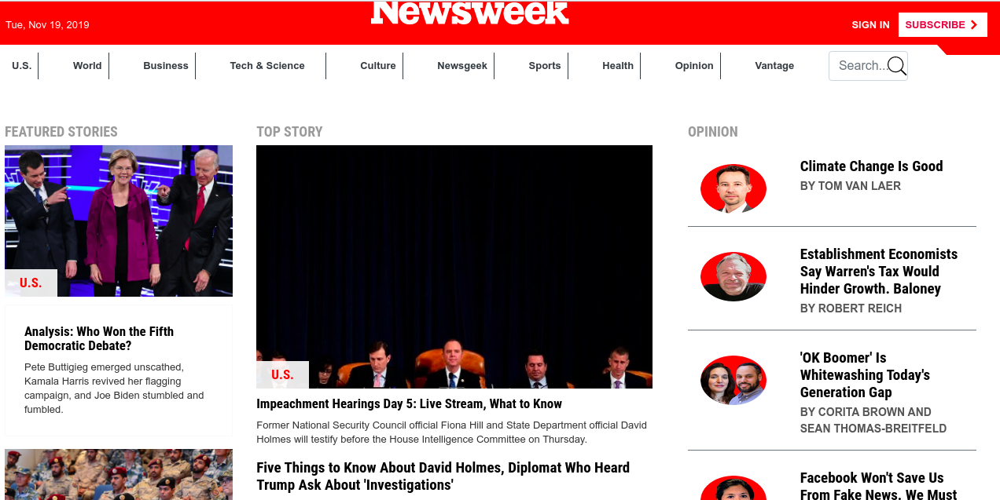

# Newsweek Website clone Using Bootstrap

This project consists of building a clone of the news site [Newsweek](https://www.newsweek.com/)using the Bootstrap framework.

## Screenshots

## Project Description

<https://www.theodinproject.com/courses/html5-and-css3/lessons/using-bootstrap>

## Prerequisites

- HTML5
- CSS
- Bootstrap
- Javascript

## Run Locally

1. Clone the project- git clone <https://github.com/bafiam/-Newsweek-clone.git>
2. Cd -Newsweek-clone
3. Run index.html on your browser

## Github Pages Link

[Live link](https://bafiam.github.io/-Newsweek-clone)

## License

This project is licensed under the MIT License - see the [LICENSE.md](LICENSE.md) file for details.

## Authors

1. [Stephen Gumba](https://github.com/bafiam)

## Acknowledgments

* Microverse.
